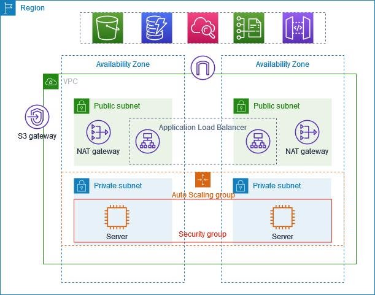
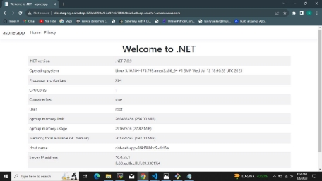

ASP .Net Application Deployment on EKS Fargate using Terraform and Helm

Step 1: Create Dockerfile for .Net Application.

- **ASP .Netcore 7 application Source code at ./app/aspnetapp**
- **Dockerfile for the following source code at ./docker**

FROM mcr.microsoft.com/dotnet/sdk:7.0 AS build WORKDIR /source

- *copy csproj and restore as distinct layers* COPY aspnetapp/\*.csproj .

RUN dotnet restore --use-current-runtime

- *copy everything else and build app*

COPY aspnetapp/. .

RUN dotnet publish --use-current-runtime --self-contained false --no-restore -o /app

- *final stage/image*

FROM mcr.microsoft.com/dotnet/aspnet:7.0 WORKDIR /app

COPY --from=build /app .

ENTRYPOINT ["dotnet", "aspnetapp.dll"]

Step 2: Create ECR Private Repository for Docker image and Helm Chart

create-repo.sh <application\_name> in ./script example: create-repo dotnet-app-testing

- Note: It creates a separate repo in ECR for docker images and helm charts. Keep name as <application\_name>-docker-local and <application\_name>-helm-local.

*#!/bin/bash*

echo "Creating ECR repository for docker image"

echo -en '\n'

aws ecr create-repository \

--repository-name $1-docker-local \

--image-scanning-configuration scanOnPush=true \

--region ap-south-1

echo " Authenticating your Docker client to your ECR registry"

echo -en '\n'

aws ecr get-login-password --region ap-south-1 | docker login --username AWS --password-stdin 028677550726.dkr.ecr.ap-south-1.amazonaws.com

echo -en '\n'

echo "Creating ECR repository for helm chart"

echo -en '\n'

aws ecr create-repository \

--repository-name $1-helm-local \

--image-scanning-configuration scanOnPush=true \

--region ap-south-1

echo " Authenticating your Helm client to your ECR registry"

echo -en '\n'

aws ecr get-login-password --region ap-south-1 | helm registry login --username AWS --password-stdin 028677550726.dkr.ecr.ap-south-1.amazonaws.com

echo -en '\n'

Step 3: Build & Push Image to ECR Private Repository

docker-build.sh <app\_version> <repo\_name> in ./script example: docker-build.sh 0.1.0

- Note: it builds the docker image and pushes it to ECR docker repo.

**#!/bin/bash**

cd ..

cp docker/Dockerfile app/

echo "Building Docker Image"

echo -en '\n'

docker build --no-cache -t $2 ./app/

echo -en '\n'

docker tag $2:latest 028677550726.dkr.ecr.ap-south-1.amazonaws.com/$2:$1 echo -en '\n'

echo "Pushing Images to ECR registry"

echo -en '\n'

docker push 028677550726.dkr.ecr.ap-south-1.amazonaws.com/$2:$1

Step 4: Build & Push Helm Package to ECR Private Repository

helm-package.sh <app\_version> <chart\_version> <repo\_name> in ./script example: helm-package.sh 0.1.0 1.0.0 app-helm-local

- Note: it should build the helm package and push it to ECR docker repo.

**#!/bin/bash![ref1]**

cd ..

cd helm

pwd

echo -en '\n'

echo "Creating helm chart......." echo -en '\n'

helm create $3

*#To remove all the files and folder except Chart.yaml ***for** res **in** $3/\*;

**do**

**if** [ "$res" = "$3/Chart.yaml" ]

**then**

continue

**fi**

rm -v -rf $res

**done**

#coping templates from dotnet to helm chart

cp -r dotnet/\* $3

echo -en '\n'

echo "Creating helm package......."

echo -en '\n'

helm package $3 --version=$1 --app-version=$2

echo -en '\n'

echo "Pushing helm package to Ecr registry......." echo -en '\n'

helm push $3-$1.tgz oci://028677550726.dkr.ecr.ap-south-1.amazonaws.com/

Terraform Modules and script to spin up infrastructure

Step 1: Set Up a Remote Backend for Terraform State File

1. Create an S3 bucket

aws s3api create-bucket --bucket <my-terraform-state-bucket> --region <region> --create-bucket-configuration LocationConstraint=<region>

2. Create an S3 bucket policy

**Next, we need to create an S3 bucket policy that allows Terraform to read and write to the S3 bucket.**

C.Configure the backend in /terraform/backen\_config/main.tf

Step 2: Creating VPC with 2 public and 2 private subnet

Step 3: Creating eks-cluster-profile module and helm release module in ./terraform directory

- **Create separate terraform module to provision AWS EKS Fargate Profile & Fargate Cluster.**
- **Create a separate terraform module to deploy a helm chart for .Net Application.**
- **Deployed Kubernetes application should be configured with Load Balancer(ALB). Added necessary code to terraform eks module for alb deployment. 12.**
- **Deployed Kubernetes application should be configured with a horizontal pod autoscaler(HPA).**

Step 4: Creating eks-deploy.sh script to deploy required infrastructure in aws

eks-deploy.sh - create and deploy eks cluster in aws.

- **Note: it should run terraform code to create eks fargate cluster, fargate profile, alb controller, metrics server in aws.**

**#!/bin/bash![ref1]**

**cd ..**

**cd terraform/eks\_fargate\_profile terraform init -upgrade terraform apply -lock=false**

Step 5: Configure aws eks cluster

***aws eks update*-*kubeconfig* --*name <cluster-name>* --*region <region>***

Step 6: Creating helm-release.sh to deploy the .Net application in the fargate cluster using terraform code

helm-release.sh <chart\_version> - create helm release and deploy into eks cluster in aws. example: helm-release.sh 1.0.0

- **Note: it should deploy the helm package version into eks cluster.**

**#!/bin/bash**

cd ..

cd terraform/helm\_release

terraform init -upgrade

terraform apply -lock=false

Results:

**Website accessible using load balancer cname or url.**

[ref1]: Aspose.Words.9c00058c-8599-49da-8973-14bc6684886a.006.png
