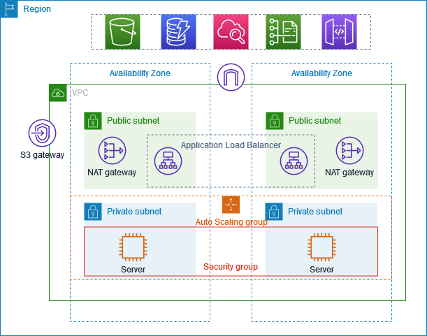


ASP .Net Application Deployment on EKS Fargate using Terraform and Helm 

# Step 1: Create Dockerfile for .Net Application.
- **ASP .Netcore 7 application  Source code at ./app/aspnetapp**

- ` `**Dockerfile for the following source code at ./docker**

|FROM mcr.microsoft.com/dotnet/sdk:7.0 AS build WORKDIR /source  *# copy csproj and restore as distinct layers* COPY aspnetapp/\*.csproj . RUN dotnet restore --use-current-runtime    *# copy everything else and build app* COPY aspnetapp/. . RUN dotnet publish --use-current-runtime --self-contained false --no-restore -o /app   *# final stage/image* FROM mcr.microsoft.com/dotnet/aspnet:7.0 WORKDIR /app COPY --from=build /app . ENTRYPOINT ["dotnet", "aspnetapp.dll"]|
| :- |

# Step 2: Create ECR Private Repository for Docker image and Helm Chart
create-repo.sh <application\_name>    in ./script example: create-repo dotnet-app-testing

- Note: It creates a separate repo in ECR for docker images and helm charts. Keep name as <application\_name>-docker-local and <application\_name>-helm-local.

|*#!/bin/bash*  echo "Creating ECR repository for docker image" echo -en '\n' aws ecr create-repository '\' --repository-name $1-docker-local \ `    `--image-scanning-configuration scanOnPush=true \ `    `--region ap-south-1 echo " Authenticating your Docker client to your ECR registry" echo -en '\n' aws ecr get-login-password --region ap-south-1 | docker login --username AWS --password-stdin 028677550726.dkr.ecr.ap-south-1.amazonaws.com echo -en '\n' echo "Creating ECR repository for helm chart" echo -en '\n' aws ecr create-repository \ `    `--repository-name $1-helm-local \ `    `--image-scanning-configuration scanOnPush=true \ `    `--region ap-south-1  echo " Authenticating your Helm client to your ECR registry" echo -en '\n' aws ecr get-login-password --region ap-south-1 | helm registry login --username AWS --password-stdin 028677550726.dkr.ecr.ap-south-1.amazonaws.com echo -en '\n'|
| :- |

# Step 3: Build & Push Image to ECR Private Repository
docker-build.sh <app\_version> <repo\_name> in ./script     example: docker-build.sh 0.1.0

- ` `Note: it builds the docker image and pushes it to ECR docker repo.

|**#!/bin/bash**  cd .. cp docker/Dockerfile app/ echo "Building Docker Image" echo -en '\n' docker build --no-cache -t  $2  ./app/ echo -en '\n' docker tag $2:latest 028677550726.dkr.ecr.ap-south-1.amazonaws.com/$2:$1 echo -en '\n' echo "Pushing Images to ECR registry" echo -en '\n' docker push 028677550726.dkr.ecr.ap-south-1.amazonaws.com/$2:$1|
| :- |

# Step 4:  Build & Push Helm Package to ECR Private Repository
helm-package.sh <app\_version> <chart\_version> <repo\_name>   in ./script  example: helm-package.sh 0.1.0 1.0.0   app-helm-local

- Note: it should build the helm package and push it to ECR docker repo.

|**#!/bin/bash**  cd .. cd helm pwd echo -en '\n' echo "Creating helm chart......." echo -en '\n' helm create $3  *#To remove all the files and folder except Chart.yaml* **for** res **in** $3/\*; **do** `    `**if** [ "$res" = "$3/Chart.yaml" ] `    `**then** `        `continue `    `**fi** `    `rm -v -rf  $res **done** #coping templates from dotnet to helm chart cp -r dotnet/\* $3  echo -en '\n' echo "Creating helm package......." echo -en '\n' helm package $3 --version=$1 --app-version=$2  echo -en '\n' echo "Pushing helm package to Ecr registry......." echo -en '\n'  helm push $3-$1.tgz oci://028677550726.dkr.ecr.ap-south-1.amazonaws.com/|
| :- |

Terraform Modules and script to spin up infrastructure

# Step 1: Set Up a Remote Backend for Terraform State File
1. Create an S3 bucket

|aws s3api create-bucket --bucket <my-terraform-state-bucket> --region <region> --create-bucket-configuration LocationConstraint=<region>|
| :- |

1. Create an S3 bucket policy

**Next, we need to create an S3 bucket policy that allows Terraform to read and write to the S3 bucket.**

1. Configure the backend in /terraform/backen\_config/main.tf

# Step 2: Creating VPC with 2 public and 2 private subnet

# Step 3: Creating eks-cluster-profile module and helm release module in ./terraform directory

- **Create separate terraform module to provision AWS EKS Fargate Profile & Fargate** 

**Cluster.**

- **Create a separate terraform module to deploy a helm chart for .Net Application.**
- **Deployed Kubernetes application should be configured with Load Balancer(ALB). Added necessary  code to terraform eks module for alb deployment. 12.**
- ` `**Deployed Kubernetes application should be configured with a horizontal pod autoscaler(HPA).**
# Step 4: Creating eks-deploy.sh script to deploy required infrastructure in aws 
eks-deploy.sh - create and deploy eks cluster in aws.   

- ` `**Note: it should run terraform code to create eks fargate cluster, fargate profile, alb controller, metrics server in aws.** 

|**#!/bin/bash  cd ..  cd terraform/eks\_fargate\_profile  terraform init -upgrade  terraform apply -lock=false**|
| :- |

# Step 5: Configure aws eks cluster

|***aws* *eks* *update*-*kubeconfig* --*name* *<cluster-name>* --*region* *<region>***|
| :- |
#
# Step 6: Creating helm-release.sh to deploy the .Net application in the fargate cluster using terraform code
helm-release.sh <chart\_version> - create helm release and deploy into eks cluster in aws.    example: helm-release.sh 1.0.0    

- **Note: it should deploy the helm package version into eks cluster.**

|**#!/bin/bash**  cd ..  cd terraform/helm\_release  terraform init -upgrade  terraform apply  -lock=false|
| :- |

Results:

## **Website  accessible using load balancer cname or url.**

